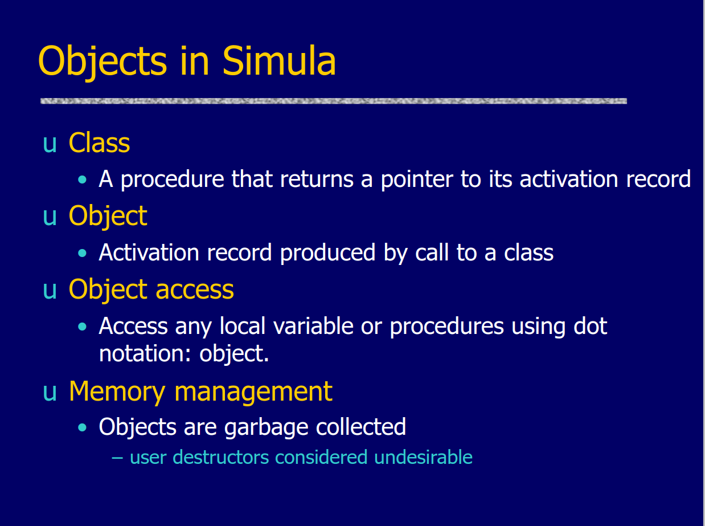
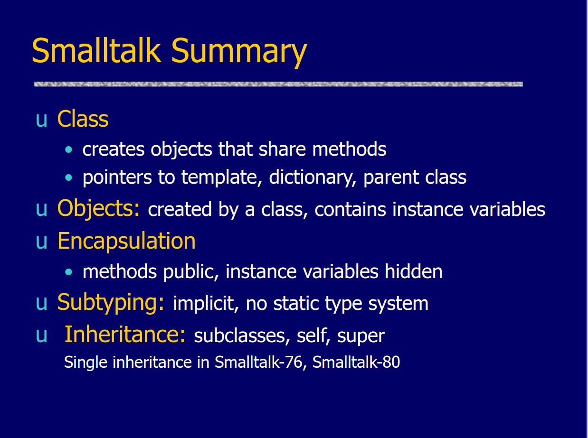

# JS OOP hands-on guide


## Introduction

This repository is designed to provide hands-on demonstrations and clear examples in Javascript to help you understand and implement OOP concepts effectively.

## Authors:

- @CREDO23 <bakerathierry@gmail.com>

## Table of contents

- [Oriented Object Programming paradigm](<Oriented Object Programming paradigm>)
- [Genesis](<Genesis of oriented object programming1>)
- [Terminology & examples](<Terminology & examples>)

# Oriented Object Programming paradigm

Object-oriented object programming is a programming paradigm that is based on objects. In general, such objects are models of real-world entities in the program (e.g.: a person, a vehicle, a home, etc.); each entity has its own characteristics (properties/attributes) and actions (methods/procedures) that are organized in a single unit called object. Those predefined units allow you to speed up the programming process and simplify software maintenance.


[Illustration]


# Genesis of oriented object programming

[Simula](https://en.wikipedia.org/wiki/Simula), a superset of [ALGOL 60](https://en.wikipedia.org/wiki/ALGOL) created between 1962 and 1967 by Kristen Nygaard and Ole-Johan Dahl, was the first language to offer object-oriented programming. An ALGOL program, represented by a block of code, included not just a sequence of operations on data, but also the structure of the data itself. Simula expanded on this idea by adding the concepts of encapsulation and inheritance. Simula also introduced crucial notions such as objects, classes, and virtual methods, which are now an integral aspect of object-oriented programming.

### Key features of Simula's approach to OOP:

- Simula introduced the notion of **classes and objects**, which allowed programmers to represent things with state and behavior.

- Simula supported **inheritance**, allowing for the construction of new classes by extending old ones. This notion is critical for reusing code and establishing hierarchical relationships between classes.

- Simula introduced the concept of **virtual procedures** (later referred to as virtual methods or polymorphic methods), which could be overridden in subclasses. This adds to polymorphism by allowing distinct classes to react to the same method call in different ways.

### Simula's code snippet:
```begin
  class Person;
    begin
      integer age;
      text name;

      procedure SetAge(a);
        integer a;
        age := a;
      end SetAge;

      procedure SetName(n);
        text n;
        name := n;
      end SetName;

      procedure DisplayInfo;
        OutText("Name: "); OutText(name); OutImage;
        OutText("Age: "); OutInteger(age, 0); OutImage;
      end DisplayInfo;
    end Person;

  class Program;
    Person p;

    begin
      p :- Person;
      p.SetName("John Doe");
      p.SetAge(30);
      p.DisplayInfo;
    end Program;
end.

```

This Simula code defines two classes, `Person` and `Program`. The `Person` class has attributes `age` and `name`, along with methods to set these attributes (`SetAge` and `SetName`) and a method to display information about the person (`DisplayInfo`). The Program class then creates an instance of the `Person` class, sets its attributes, and displays the information.



At graduate school in 1966, [Alan Kay](https://en.wikipedia.org/wiki/Alan_Kay), considered the person behind the creation of Object Oriented Programming, came up with the object oriented programming paradigm. He played a crucial role in the creation of Smalltalk, an influential programming language that covers many OOP concepts. Alan Kay's thoughts on OOP were formed by his computer science experiences, perceptions, and goals.

[SmallTalk](https://en.wikipedia.org/wiki/Smalltalk#:~:text=Smalltalk%20is%20a%20purely%20object,later%20found%20use%20in%20business.) in the game by Alan Kay, Dan Ingalls, Adele Goldberg, and others at Xerox PARC, influenced by Simula, was the first that implemented purely the object-oriented approach; you couldn't even construct a "Hello Word" program without defining a class. Simula was the first acknowledged object programming language, but it was not implemented properly; instead, it was ALGOL 60 with classes and objects appended.

### Key features of Smalltalk's approach to OOP:

- **Everything is an Object**: The Smalltalk language is based on the idea that everything is an object. This covers not just user-defined classes and objects, but also basic data types and even the code itself.

- **Message carrying**: Message carrying between objects is very important in Smalltalk. Objects interact by sending messages to one another, and method invocation is accomplished through this process.

- Smalltalk is **dynamically typed**, which means that a variable's type is decided at runtime. This flexibility allows for a high level of dynamism in the language.

### Smalltalk's code snippet:

```Object subclass: Person [
    | name age |

    Person >> initialize [
        name := ''.
        age := 0.
    ]

    Person >> setName: aName age: anAge [
        name := aName.
        age := anAge.
    ]

    Person >> displayInfo [
        ^'Name: ', name, ', Age: ', age printString
    ]
]

"Create an instance of the Person class"
| johnDoe |
johnDoe := Person new.
johnDoe initialize.
johnDoe setName: 'John Doe' age: 30.

"Display information about the person"
Transcript show: johnDoe displayInfo; cr.

```

In this smalltalk code:
- The `Person` class has `name` and `age` as instance variables and `initialize`, `setName`, and `displayInfo` as methods.
- An instance of the `Person` class (`johnDoe`) is created, initialized, and its information is displayed in the Transcript.



[In a 2003 email exchange](https://userpage.fu-berlin.de/~ram/pub/pub_jf47ht81Ht/doc_kay_oop_en), Alan Kay clarified what he meant when he called Smalltalk “object-oriented”:

Alan Kay defined what he meant by "object-oriented" [in a 2003 email exchange](https://userpage.fu-berlin.de/~ram/pub/pub_jf47ht81Ht/doc_kay_oop_en):

> “OOP to me means only messaging, local retention and protection and hiding of state-process, and extreme late-binding of all things.”
> ~ Alan Kay

In other words, according to Alan Kay, the essential ingredients of OOP are:

- Message passing
- Encapsulation
- Dynamic binding

Simula and Smalltalk both made substantial contributions to the development of object-oriented programming, but with distinct focuses and methodologies. Simula emphasized simulation and modeling, introducing the concepts of classes and objects, whereas Smalltalk emphasized simplicity, universality, and the idea that everything is an object, with a heavy dependence on message passing.

It is critical to honor and recognize the amazing pioneers who shaped Object-Oriented Programming. Understanding the historical background and growth of OOP allows us to appreciate the strength and variety it provides as a programming paradigm.

# Terminology & examples
  - [Object](/terms-&-examples/object/)
  - [Class](/terms-&-examples/class/)
  - Class-based vs prototype-based
  - Encapsulation
  - Inheritance
  - Abstraction
  - Abstract Class
  - Polymorphism
    - Compile-time polymorphism (Method Overloading)
    - Runtime polymorphism (Method Overriding)
  - Composition
  - Delegation
  - Association
  - Open recursion
  - Mixins